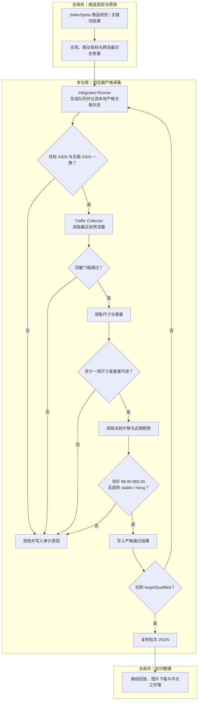

<div align="center">

# SellerSprite Userscripts

**Amazon 美国站选品的 ScriptCat 浏览器自动化层**

把 SellerSprite 流量洞察、Amazon 商品页数据和批量 ASIN 队列串成可暂停、可恢复、可审计的严格采集流程。

[](https://github.com/yuanzeli695-byte/sellersprite-userscripts/actions/workflows/validate.yml)
[](scripts/sellersprite-integrated-runner.user.js)
[](scripts/sellersprite-traffic-collector.user.js)
[](#脚本协同协议)
[](skills/amazon-us-strict-selection/SKILL.md)

</div>

## 项目定位

本仓库维护两份互相配合的用户脚本，负责完整选品流程中的**浏览器严格采集阶段**：

- **Traffic Collector** 从 SellerSprite 流量图读取最近自然流量数据，谨慎推导明确的零自然流量，并输出 JSON 与门槛/耗时日志。
- **Integrated Runner** 管理批量 ASIN 队列，执行历史排重、ASIN 一致性、自然流量、尺寸信息、现价和价格趋势门槛。
- **Amazon US Strict Selection Skill** 为 Codex 提供失败关闭的操作、审计、浏览器联调和可选完整工作簿流程规范。
- **GitHub** 是唯一源代码；VS Code 保存文件时可同步到 Chrome 的 ScriptCat，正式版本再通过 GitHub Raw 自动更新。

> [!IMPORTANT]
> 这不是一套完整的选品后台。候选搜索、禁限售与商业指标预筛、跨设备历史台账、图片下载和中文 Excel 生成属于完整业务流程，但不在当前仓库实现。Runner 只在当前浏览器的 Amazon `localStorage` 中维护本地严格合格历史。

本文根据 2026-07-13 的《亚马逊美国站选品自动化流程与数据处理报告》整理，并以当前仓库代码为技术事实基准。

## 功能概览

| 能力 | 当前实现 |
| --- | --- |
| 批量 ASIN | 输入一行一个 ASIN，生成本地批次并自动逐页处理 |
| 严格短路 | 任一门槛失败后跳过后续昂贵步骤，保留拒绝阶段、规则和原因 |
| 流量门槛 | 最近最多 4 周、至少 3 周；最新值、均值和最低值均不得低于 70% |
| 页面一致性 | 检测 Amazon 变体重定向导致的目标 ASIN 与实际 ASIN 不一致 |
| 尺寸采集 | 从 SellerSprite/Amazon 页面读取商品或包装尺寸、重量信息 |
| 现价与趋势 | 当前采样价必须在 $9.90-$50.00，趋势必须为 stable 或 rising |
| 本地历史排重 | 新建批次时跳过同一门槛配置下已合格的 ASIN；门槛变化会使自动记录的旧历史失效 |
| 审计日志 | combined JSON 附带门槛与耗时遥测，也可分别复制 Gate/Timing TSV |
| 批次控制 | 支持 Generate、Start、Pause、Resume、Clear 和目标合格数停止 |
| 可追溯输出 | combined JSON 保留时间、来源、门槛与短路原因；enrichment JSON 提供精简补充字段 |
| 自动更新 | 通过固定的 GitHub Raw 地址为 ScriptCat 提供更新 |
| 自动校验 | 本地测试和 GitHub Actions 检查语法、版本、协议和核心规则 |

## 仓库内容

| 文件 | 版本 | 职责 | 安装 |
| --- | ---: | --- | --- |
| [sellersprite-traffic-collector.user.js](scripts/sellersprite-traffic-collector.user.js) | 0.4.6 | 采集自然流量、明确零占比证据和采集遥测 | [安装 Collector](https://raw.githubusercontent.com/yuanzeli695-byte/sellersprite-userscripts/main/scripts/sellersprite-traffic-collector.user.js) |
| [sellersprite-integrated-runner.user.js](scripts/sellersprite-integrated-runner.user.js) | 0.3.7 | 管理批次，串联历史、流量、尺寸、现价和趋势门槛 | [安装 Runner](https://raw.githubusercontent.com/yuanzeli695-byte/sellersprite-userscripts/main/scripts/sellersprite-integrated-runner.user.js) |
| [CONFIGURATION.md](docs/CONFIGURATION.md) | - | 安装顺序、开关、历史台账、迁移和故障排查 | - |
| [amazon-us-strict-selection](skills/amazon-us-strict-selection/SKILL.md) | - | 可安装的 Codex Skill；操作、审计并保护严格门槛 | [查看 Skill](skills/amazon-us-strict-selection/SKILL.md) |
| [validate-userscripts.mjs](tools/validate-userscripts.mjs) | - | 校验元数据、版本、更新地址和 DOM 协议 | - |
| [core-logic.test.mjs](tools/core-logic.test.mjs) | - | 回归测试流量、短路、ASIN、尺寸和价格趋势逻辑 | - |
| [validate-skill.mjs](tools/validate-skill.mjs) | - | 校验 Skill 结构、隐私、版本同步和预检失败关闭 | - |
| [set-version.mjs](tools/set-version.mjs) | - | 同步修改脚本元数据版本和运行时版本 | - |

Integrated Runner 依赖 Collector 提供的 <code>#ss-collector-panel</code>、<code>#ss-collector-run</code> 和 <code>#ss-collector-json</code> 接口。两个脚本必须同时启用，并应先安装 Collector。

## Codex Skill

仓库内提供可安装的 `amazon-us-strict-selection` Skill。它有两种工作模式：

- `userscripts`：直接用于本仓库的脚本安装、配置、协议审计、测试和 Chrome 联调。
- `full`：用于兼容的外部完整选品项目，包括候选预筛、图片、回放、中文工作簿和验收。完整流水线不在本仓库内，调用时必须提供真实项目根目录。

### 安装 Skill

在 Codex 中输入：

```text
Use $skill-installer to install https://github.com/yuanzeli695-byte/sellersprite-userscripts/tree/main/skills/amazon-us-strict-selection
```

安装成功后，从下一轮任务开始直接调用：

```text
Use $amazon-us-strict-selection to audit the SellerSprite userscript pair in this repository.
```

完整流程调用示例：

```text
Use $amazon-us-strict-selection in full mode with project root C:\path\to\amazon_products. Run preflight first and stop if any hard gate or dependency is missing.
```

手动安装的等价 PowerShell 命令：

```powershell
$codexHome = if ($env:CODEX_HOME) { $env:CODEX_HOME } else { Join-Path $env:USERPROFILE '.codex' }
python "$codexHome\skills\.system\skill-installer\scripts\install-skill-from-github.py" `
  --repo yuanzeli695-byte/sellersprite-userscripts `
  --path skills/amazon-us-strict-selection
Test-Path "$codexHome\skills\amazon-us-strict-selection\SKILL.md"
```

Skill 预检需要 Python 3.10 或更高版本；仓库测试和兼容的完整工作簿流程需要 Node.js 20 或更高版本。安装 Skill 不会自动安装 Chrome、ScriptCat、SellerSprite，也不会下载你的历史 ASIN 或运行数据。

## 完整选品流程



流程遵循“先便宜、后昂贵；先硬排、后补全”的顺序。浏览器脚本只为仍有通过可能的候选读取图表和详情数据。

### 数据来源

| 数据来源 | 采集方式 | 用途 |
| --- | --- | --- |
| SellerSprite 商品研究 / 关键词结果 | 在仓库外导出或整理为 TSV/JSON | 形成候选 ASIN、标题、品牌、价格、评分、评论、销量、上架日期、变体和图片来源 |
| Amazon 商品详情页 | Runner 在已登录的 Chrome 会话中逐个打开 ASIN | 核验实际 ASIN，读取详情页链接、尺寸、重量等字段 |
| SellerSprite 流量洞察 | Collector 扫描最近图表 tooltip | 计算最新自然流量、最近均值、最近最低值和有效周数 |
| SellerSprite 页面价格图 | Runner 读取近期价格点 | 计算价格区间和 stable/rising/declining/volatile/no_data 分类 |
| 本地严格合格历史 | Runner 按门槛指纹保存在当前浏览器的 Amazon `localStorage` | 新建队列时跳过同配置下已合格 ASIN；公开版预置列表为空 |
| 跨设备历史交付台账 | 在仓库外维护并用于候选预筛 | 跨浏览器、跨设备避免重复采集与重复汇总 |

## 当前严格门槛

以下门槛由当前仓库代码直接执行：

| 顺序 | 门槛 | 通过条件 | 失败后的短路 |
| ---: | --- | --- | --- |
| 1 | 本地历史 | ASIN 不在当前浏览器的严格合格历史中 | 命中后直接跳过，不访问商品页 |
| 2 | ASIN 一致性 | Amazon 当前页面 ASIN 与队列目标一致 | 跳过流量、尺寸和价格 |
| 3 | 自然流量 | <code>weeksRead &gt;= 3</code>，且最新值、最近均值、最近最低值均不低于 70%；同时要求 <code>decision=pass</code> 与 <code>pass70=true</code> | 跳过尺寸和价格 |
| 4 | 尺寸信息 | 商品尺寸、商品重量、包装尺寸、包装重量中至少一项可读 | 跳过价格 |
| 5 | 当前价格 | 最近一个有效价格样本必须在 $9.90-$50.00（含边界） | 记录 <code>price_current_missing</code> 或 <code>price_current_out_of_range</code> 并拒绝 |
| 6 | 价格趋势 | 仅允许 <code>stable</code> 或 <code>rising</code> | 记录趋势规则并拒绝 |
| 7 | 目标数量 | 严格通过数达到 <code>targetQualified</code> | 停止访问队列剩余商品 |

> [!NOTE]
> 当前尺寸门槛不判断具体长宽高或重量上限。禁限售、评分、评论、销量、上架时间和变体数仍应在进入 Runner 前完成预筛；现价范围已由 Runner 0.3.7 执行。

### 完整流程中的仓库外预筛

2026-07-13 流程报告采用的预筛口径包括：

- 禁限售、合规和明显 IP 风险优先硬排。
- 当前售价参考范围为 $9.90-$50.00。
- 评分不低于 4.0，上架不超过 90 天，变体不超过 25。
- 评论数通常不高于约 100。
- 单 ASIN 月销理想区间为 50-300，超过 1500 作为硬排。
- 历史严格合格 ASIN 在进入浏览器队列前跳过，且不计入本批合格数。

这些规则用于说明完整业务流程，不代表当前仓库已经实现相应的候选搜索或离线预筛器。

## 脚本协同协议

Runner 不通过状态文本猜测 Collector 是否完成，而是使用版本化的 DOM 协议：

| 字段 | 值或作用 |
| --- | --- |
| <code>data-ss-protocol-version</code> | 当前值 1 |
| <code>data-ss-schema-version</code> | 当前值 <code>sellerSpriteTraffic/v1</code> |
| <code>data-ss-running</code> | Collector 是否正在运行 |
| <code>data-ss-run-id</code> | 本次采集的唯一运行标识 |
| <code>data-ss-result-ready</code> | 结果是否已经写入 |
| <code>data-ss-result-run-id</code> | 结果所属的运行标识，用于拒绝旧结果 |

Collector 的 JSON 结果包含 Schema、版本、run ID、ASIN、判断、读取周数、最新自然流量、最近均值、最近最低值、采集窗口、详情和时间戳。

Runner 的 combined JSON Schema 为 <code>sellerSpriteIntegratedBatch/v0.3.0</code>，包含目标/实际 ASIN、流量、尺寸、重量、当前/最低/最高价格、价格趋势、本地历史跳过、严格结论，以及独立的 Runner/Collector 遥测。enrichment JSON 只保留尺寸、价格趋势和原始 <code>priceSamples</code>，不包含完整审计日志。

## 安装

### 前置条件

- Chrome
- [ScriptCat](https://docs.scriptcat.org/)
- SellerSprite 浏览器扩展，并已登录可查看流量洞察
- Amazon.com 登录状态正常

### 安装顺序

1. 安装 [SellerSprite Traffic Collector MVP 0.4.6](https://raw.githubusercontent.com/yuanzeli695-byte/sellersprite-userscripts/main/scripts/sellersprite-traffic-collector.user.js)。
2. 安装 [SellerSprite Integrated Runner 0.3.7](https://raw.githubusercontent.com/yuanzeli695-byte/sellersprite-userscripts/main/scripts/sellersprite-integrated-runner.user.js)。
3. 在 ScriptCat 中确认两个脚本均已启用。
4. 禁用或删除旧的 Runner/Collector 版本及其他重复条目，避免多个版本同时注入页面。
5. 打开新的 Amazon 商品页，确认页面中同时出现 Runner 和 Collector 面板。

更详细的开关、历史 ASIN、价格门槛和升级迁移步骤见 [配置说明](docs/CONFIGURATION.md)。

## 使用

1. 在 Amazon.com 打开任意商品详情页。
2. 在 Runner 面板填写 <code>batchName</code>、<code>operator</code> 和 <code>targetQualified</code>。
3. 将 ASIN 按“一行一个”粘贴到 <code>QUEUE input</code>。
4. 点击 **Generate** 生成本地批次，再点击 **Start**。
5. Runner 会自动打开队列商品，并按历史、ASIN、流量、尺寸、现价和价格趋势依次判断。
6. 需要中断时先点击 **Pause**；手动处理登录、CAPTCHA 或页面问题后点击 **Resume**。
7. 完成后使用 **Copy combined JSON** 或 **Copy enrichment JSON** 复制结果；需要审计时再复制 **Copy gate log TSV** 和 **Copy timing log TSV**。

采集图表 tooltip 时应避免频繁切换标签页或移动鼠标，以免扰动可见图表状态。

## 运行结果快照

<details>
<summary><strong>查看 2026-07-12 历史案例（非性能承诺）</strong></summary>

以下数据来自一次完整业务运行，用于展示端到端流程产物，不代表当前仓库功能或持续性能承诺：

| 指标 | 结果 |
| --- | ---: |
| 最终严格合格 | 20 品 |
| 全新 ASIN | 17 条 |
| 历史严格合格台账 | 45 条 |
| 主图嵌入验收 | 20 / 20 |

该运行在浏览器采集后继续执行了仓库外的离线回放、图片下载、中文工作簿生成、公式扫描和图片对象验收。

</details>

## VS Code 与 ScriptCat 协同

    本地 Git 仓库 -> VS Code 保存 -> ScriptCat 自动同步 -> Chrome 页面验证
           |
           +-> git commit / git push -> GitHub Raw -> 其他安装检查更新

GitHub 仓库是唯一源代码。这不是双向自动合并：直接在 ScriptCat 编辑器中修改的代码不会自动写回 Git。

### 首次连接

1. 在 VS Code 安装扩展 <code>CodFrm.scriptcat-vscode</code>。
2. 在 ScriptCat 管理面板进入“工具 > 开发工具”。
3. 启用“自动连接 VSCode 服务”并点击“连接”。
4. 在 VS Code 按 <code>Ctrl+Shift+P</code>，运行 <code>scriptcat.autoTarget</code>。
5. 打开或保存 <code>scripts/*.user.js</code>，脚本会自动同步到 ScriptCat。

## 本地开发

    npm test

测试内容包括：

- 两个用户脚本的 JavaScript 语法。
- <code>@version</code> 与运行时面板版本一致。
- GitHub 更新地址、DOM 接口和 Collector 协议完整。
- 自然流量 70% 门槛和最少有效周数。
- ASIN 重定向、尺寸存在性、现价范围、价格趋势、历史排重和条件重试核心规则。
- 显式零自然流量推导、遥测字段和 Gate/Timing TSV 转义。
- 批次名称不通过 <code>innerHTML</code> 注入选项。
- Pause 状态不会被正在处理的行覆盖。
- Codex Skill 的目录、frontmatter、界面元数据、相对链接和公开隐私检查。
- Skill 中的脚本版本与仓库版本同步，并对不兼容项目根目录保持失败关闭。

GitHub Actions 会在每次 push 和 pull request 时执行同一组检查。

### 发布新版本

版本命令只同步脚本的 `@version` 与运行时 `VERSION`：

    npm run version:integrated -- 0.3.8
    npm run version:collector -- 0.4.7

随后同步更新 README 徽章/版本表、`docs/CONFIGURATION.md` 当前版本和 `CHANGELOG.md` 发布说明，再执行：

    npm test
    git add .
    git commit -m "release: update userscripts"
    git push

GitHub Raw 通常会缓存几分钟。推送后 ScriptCat 暂时读取到旧文件时，稍后重新检查更新即可。

## 目录结构

    .
    |-- scripts/
    |   |-- sellersprite-integrated-runner.user.js
    |   +-- sellersprite-traffic-collector.user.js
    |-- tools/
    |   |-- core-logic.test.mjs
    |   |-- set-version.mjs
    |   |-- validate-skill.mjs
    |   +-- validate-userscripts.mjs
    |-- skills/
    |   +-- amazon-us-strict-selection/
    |       |-- SKILL.md
    |       |-- agents/openai.yaml
    |       |-- references/
    |       +-- scripts/preflight.py
    |-- .github/workflows/validate.yml
    |-- docs/
    |   +-- CONFIGURATION.md
    |-- CHANGELOG.md
    |-- package.json
    +-- README.md

## 数据与隐私

- 脚本不包含 API key、密码或远程数据上报。
- Runner 会在 <code>amazon.com</code> 的 <code>localStorage</code> 中保存批次 ASIN、operator、采集结果、历史严格合格 ASIN 和遥测，以便跨商品页面恢复进度。
- Amazon 同源页面中的其他脚本理论上也能读取这些数据，不要在 <code>operator</code> 或 <code>batchName</code> 中填写敏感信息。
- Collector 不额外持久化流量结果。
- Collector 和 Runner 都不会向远程服务器上传结果；遥测只写入当前批次并通过复制按钮导出。
- 导出的 URL 会移除本项目使用的自动化查询参数和哈希标记。
- 公开 Skill 不包含历史严格合格 ASIN、候选数据、运行产物、Cookie、API Key 或作者本机绝对路径。

## 限制与人工边界

- SellerSprite 未登录、Amazon CAPTCHA 或页面拦截需要用户手动处理；先 Pause，再处理页面，脚本不会自动识别并暂停。
- SellerSprite 页面结构、中文按钮文本或 CSS 选择器变化时，采集器可能需要同步调整。
- 流量有效周数不足、图表未加载或关键尺寸字段缺失时，结果会进入复核或拒绝，而不是自动补数。
- Runner 的历史台账只存在当前浏览器的 Amazon 同源 <code>localStorage</code>，不会自动跨设备同步；公开版预置历史列表为空。
- 两个遥测开关和历史预置列表是脚本内配置，不是面板设置；修改后需要重新保存/安装脚本。
- 当前仓库不负责候选搜索、跨设备历史台账、图片下载或最终 Excel 工作簿生成。
- Skill 的 `full` 模式只负责约束和检查兼容的外部完整项目；本仓库没有随 Skill 打包私有流水线实现或依赖。

## 问题反馈

发现页面结构变化、协议不匹配或采集异常时，请提交 [Issue](https://github.com/yuanzeli695-byte/sellersprite-userscripts/issues)，并附上脚本版本、目标 ASIN、失败阶段和已脱敏的错误信息。
