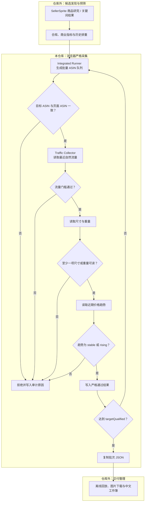

# SellerSprite Userscripts

**Amazon 美国站选品的 ScriptCat 浏览器自动化层**

把 SellerSprite 流量洞察、Amazon 商品页数据和批量 ASIN 队列串成可暂停、可恢复、可审计的严格采集流程。

## 项目定位

本仓库维护两份互相配合的用户脚本，负责完整选品流程中的**浏览器严格采集阶段**：

- **Traffic Collector** 从 SellerSprite 流量图读取最近自然流量数据，并输出结构化 JSON。
- **Integrated Runner** 管理批量 ASIN 队列，依次执行 ASIN 一致性、自然流量、尺寸信息和价格趋势门槛。
- **GitHub** 是唯一源代码；VS Code 保存文件时可同步到 Chrome 的 ScriptCat，正式版本再通过 GitHub Raw 自动更新。

> [!IMPORTANT]
> 这不是一套完整的选品后台。候选搜索、禁限售与商业指标预筛、历史合格台账、图片下载和中文 Excel 生成属于完整业务流程，但不在当前仓库实现。

本文根据 2026-07-13 的《亚马逊美国站选品自动化流程与数据处理报告》整理，并以当前仓库代码为技术事实基准。

## 功能概览

| 能力 | 当前实现 |
| --- | --- |
| 批量 ASIN | 输入一行一个 ASIN，生成本地批次并自动逐页处理 |
| 严格短路 | 任一门槛失败后跳过后续昂贵步骤，保留拒绝阶段、规则和原因 |
| 流量门槛 | 最近最多 4 周、至少 3 周；最新值、均值和最低值均不得低于 70% |
| 页面一致性 | 检测 Amazon 变体重定向导致的目标 ASIN 与实际 ASIN 不一致 |
| 尺寸采集 | 从 SellerSprite/Amazon 页面读取商品或包装尺寸、重量信息 |
| 价格趋势 | 读取近期价格点并分类为 stable、rising、declining、volatile 或 no_data |
| 批次控制 | 支持 Generate、Start、Pause、Resume、Clear 和目标合格数停止 |
| 可追溯输出 | 复制 combined JSON 或 enrichment JSON，保留时间、来源、门槛与短路原因 |
| 自动更新 | 通过固定的 GitHub Raw 地址为 ScriptCat 提供更新 |
| 自动校验 | 本地测试和 GitHub Actions 检查语法、版本、协议和核心规则 |

## 仓库内容

| 文件 | 版本 | 职责 | 安装 |
| --- | ---: | --- | --- |
| [sellersprite-traffic-collector.user.js](scripts/sellersprite-traffic-collector.user.js) | 0.4.4 | 采集 SellerSprite 最近自然流量指标，输出协议化结果 | [安装 Collector](https://raw.githubusercontent.com/yuanzeli695-byte/sellersprite-userscripts/main/scripts/sellersprite-traffic-collector.user.js) |
| [sellersprite-integrated-runner.user.js](scripts/sellersprite-integrated-runner.user.js) | 0.3.4 | 管理批次，串联流量、尺寸和价格趋势门槛 | [安装 Runner](https://raw.githubusercontent.com/yuanzeli695-byte/sellersprite-userscripts/main/scripts/sellersprite-integrated-runner.user.js) |
| [validate-userscripts.mjs](tools/validate-userscripts.mjs) | - | 校验元数据、版本、更新地址和 DOM 协议 | - |
| [core-logic.test.mjs](tools/core-logic.test.mjs) | - | 回归测试流量、短路、ASIN、尺寸和价格趋势逻辑 | - |
| [set-version.mjs](tools/set-version.mjs) | - | 同步修改脚本元数据版本和运行时版本 | - |

Integrated Runner 依赖 Collector 提供的 <code>#ss-collector-panel</code>、<code>#ss-collector-run</code> 和 <code>#ss-collector-json</code> 接口。两个脚本必须同时启用，并应先安装 Collector。

## 完整选品流程

流程遵循“先便宜、后昂贵；先硬排、后补全”的顺序。浏览器脚本只为仍有通过可能的候选读取图表和详情数据。

### 数据来源

| 数据来源 | 采集方式 | 用途 |
| --- | --- | --- |
| SellerSprite 商品研究 / 关键词结果 | 在仓库外导出或整理为 TSV/JSON | 形成候选 ASIN、标题、品牌、价格、评分、评论、销量、上架日期、变体和图片来源 |
| Amazon 商品详情页 | Runner 在已登录的 Chrome 会话中逐个打开 ASIN | 核验实际 ASIN，读取详情页链接、尺寸、重量等字段 |
| SellerSprite 流量洞察 | Collector 扫描最近图表 tooltip | 计算最新自然流量、最近均值、最近最低值和有效周数 |
| SellerSprite 页面价格图 | Runner 读取近期价格点 | 计算价格区间和 stable/rising/declining/volatile/no_data 分类 |
| 历史交付与合格台账 | 在仓库外维护并用于候选预筛 | 跳过历史严格合格 ASIN，避免重复采集与重复汇总 |

## 当前严格门槛

以下门槛由当前仓库代码直接执行：

| 顺序 | 门槛 | 通过条件 | 失败后的短路 |
| ---: | --- | --- | --- |
| 1 | ASIN 一致性 | Amazon 当前页面 ASIN 与队列目标一致 | 跳过流量、尺寸和价格 |
| 2 | 自然流量 | <code>weeksRead &gt;= 3</code>，且最新值、最近均值、最近最低值均不低于 70%；同时要求 <code>decision=pass</code> 与 <code>pass70=true</code> | 跳过尺寸和价格 |
| 3 | 尺寸信息 | 商品尺寸、商品重量、包装尺寸、包装重量中至少一项可读 | 跳过价格 |
| 4 | 价格趋势 | 仅允许 <code>stable</code> 或 <code>rising</code> | 记录趋势规则并拒绝 |
| 5 | 目标数量 | 严格通过数达到 <code>targetQualified</code> | 停止访问队列剩余商品 |

> [!NOTE]
> 当前尺寸门槛不判断具体长宽高或重量上限。当前价格门槛只判断趋势，不直接执行 $9.90-$50.00 的现价范围。禁限售、评分、评论、销量、上架时间、变体数和现价范围应在进入 Runner 前完成预筛。

### 完整流程中的仓库外预筛

2026-07-13 流程报告采用的预筛口径包括：

- 禁限售、合规和明显 IP 风险优先硬排。
- 当前售价参考范围为 $9.90-$50.00。
- 评分不低于 4.0，上架不超过 90 天，变体不超过 25。
- 评论数通常不高于约 100。
- 单 ASIN 月销理想区间为 50-300，超过 1500 作为硬排。
- 历史严格合格 ASIN 在进入浏览器队列前跳过，且不计入本批合格数。

这些规则用于说明完整业务流程，不代表当前仓库已经实现相应的候选搜索或离线预筛器。

## 脚本协同协议

Runner 不通过状态文本猜测 Collector 是否完成，而是使用版本化的 DOM 协议：

| 字段 | 值或作用 |
| --- | --- |
| <code>data-ss-protocol-version</code> | 当前值 1 |
| <code>data-ss-schema-version</code> | 当前值 <code>sellerSpriteTraffic/v1</code> |
| <code>data-ss-running</code> | Collector 是否正在运行 |
| <code>data-ss-run-id</code> | 本次采集的唯一运行标识 |
| <code>data-ss-result-ready</code> | 结果是否已经写入 |
| <code>data-ss-result-run-id</code> | 结果所属的运行标识，用于拒绝旧结果 |

Collector 的 JSON 结果包含 Schema、版本、run ID、ASIN、判断、读取周数、最新自然流量、最近均值、最近最低值、采集窗口、详情和时间戳。

Runner 的 combined JSON Schema 为 <code>sellerSpriteIntegratedBatch/v0.3.0</code>，包含目标/实际 ASIN、流量、尺寸、重量、价格趋势、严格结论、拒绝阶段、拒绝规则、拒绝原因和被短路的步骤。enrichment JSON 只保留尺寸和价格趋势补充字段。

## 安装

### 前置条件

- Chrome
- [ScriptCat](https://docs.scriptcat.org/)
- SellerSprite 浏览器扩展，并已登录可查看流量洞察
- Amazon.com 登录状态正常

### 安装顺序

1. 安装 [SellerSprite Traffic Collector MVP](https://raw.githubusercontent.com/yuanzeli695-byte/sellersprite-userscripts/main/scripts/sellersprite-traffic-collector.user.js)。
2. 安装 [SellerSprite Integrated Runner](https://raw.githubusercontent.com/yuanzeli695-byte/sellersprite-userscripts/main/scripts/sellersprite-integrated-runner.user.js)。
3. 在 ScriptCat 中确认两个脚本均已启用。
4. 禁用或删除旧的 SellerSprite Integrated Runner 0.3.3 及其他重复条目，避免多个版本同时注入页面。
5. 打开新的 Amazon 商品页，确认页面中同时出现 Runner 和 Collector 面板。

## 使用

1. 在 Amazon.com 打开任意商品详情页。
2. 在 Runner 面板填写 <code>batchName</code>、<code>operator</code> 和 <code>targetQualified</code>。
3. 将 ASIN 按“一行一个”粘贴到 <code>QUEUE input</code>。
4. 点击 **Generate** 生成本地批次，再点击 **Start**。
5. Runner 会自动打开队列商品，并按 ASIN、流量、尺寸、价格趋势依次判断。
6. 需要中断时先点击 **Pause**；手动处理登录、CAPTCHA 或页面问题后点击 **Resume**。
7. 完成后使用 **Copy combined JSON** 或 **Copy enrichment JSON** 复制结果。

采集图表 tooltip 时应避免频繁切换标签页或移动鼠标，以免扰动可见图表状态。

## 运行结果快照

<strong>查看 2026-07-12 历史案例（非性能承诺）</strong>

以下数据来自一次完整业务运行，用于展示端到端流程产物，不代表当前仓库功能或持续性能承诺：

| 指标 | 结果 |
| --- | ---: |
| 最终严格合格 | 20 品 |
| 全新 ASIN | 17 条 |
| 历史严格合格台账 | 45 条 |
| 主图嵌入验收 | 20 / 20 |

该运行在浏览器采集后继续执行了仓库外的离线回放、图片下载、中文工作簿生成、公式扫描和图片对象验收。

## VS Code 与 ScriptCat 协同

    本地 Git 仓库 -> VS Code 保存 -> ScriptCat 自动同步 -> Chrome 页面验证
           |
           +-> git commit / git push -> GitHub Raw -> 其他安装检查更新

GitHub 仓库是唯一源代码。这不是双向自动合并：直接在 ScriptCat 编辑器中修改的代码不会自动写回 Git。

### 首次连接

1. 在 VS Code 安装扩展 <code>CodFrm.scriptcat-vscode</code>。
2. 在 ScriptCat 管理面板进入“工具 > 开发工具”。
3. 启用“自动连接 VSCode 服务”并点击“连接”。
4. 在 VS Code 按 <code>Ctrl+Shift+P</code>，运行 <code>scriptcat.autoTarget</code>。
5. 打开或保存 <code>scripts/*.user.js</code>，脚本会自动同步到 ScriptCat。

## 本地开发

    npm test

测试内容包括：

- 两个用户脚本的 JavaScript 语法。
- <code>@version</code> 与运行时面板版本一致。
- GitHub 更新地址、DOM 接口和 Collector 协议完整。
- 自然流量 70% 门槛和最少有效周数。
- ASIN 重定向、尺寸存在性和价格趋势核心规则。
- 批次名称不通过 <code>innerHTML</code> 注入选项。
- Pause 状态不会被正在处理的行覆盖。

GitHub Actions 会在每次 push 和 pull request 时执行同一组检查。

### 发布新版本

    npm run version:integrated -- 0.3.5
    npm run version:collector -- 0.4.5
    npm test
    git add .
    git commit -m "release: update userscripts"
    git push

GitHub Raw 通常会缓存几分钟。推送后 ScriptCat 暂时读取到旧文件时，稍后重新检查更新即可。

## 目录结构

    .
    |-- scripts/
    |   |-- sellersprite-integrated-runner.user.js
    |   +-- sellersprite-traffic-collector.user.js
    |-- tools/
    |   |-- core-logic.test.mjs
    |   |-- set-version.mjs
    |   +-- validate-userscripts.mjs
    |-- .github/workflows/validate.yml
    |-- CHANGELOG.md
    |-- package.json
    +-- README.md

## 数据与隐私

- 脚本不包含 API key、密码或远程数据上报。
- Runner 会在 <code>amazon.com</code> 的 <code>localStorage</code> 中保存批次 ASIN、operator 和采集结果，以便跨商品页面恢复进度。
- Amazon 同源页面中的其他脚本理论上也能读取这些数据，不要在 <code>operator</code> 或 <code>batchName</code> 中填写敏感信息。
- Collector 不额外持久化流量结果。
- 导出的 URL 会移除本项目使用的自动化查询参数和哈希标记。

## 限制与人工边界

- SellerSprite 未登录、Amazon CAPTCHA 或页面拦截需要用户手动处理；先 Pause，再处理页面，脚本不会自动识别并暂停。
- SellerSprite 页面结构、中文按钮文本或 CSS 选择器变化时，采集器可能需要同步调整。
- 流量有效周数不足、图表未加载或关键尺寸字段缺失时，结果会进入复核或拒绝，而不是自动补数。
- Runner 只对本次输入队列去重，不维护历史严格合格 ASIN 台账。
- 当前仓库不负责候选搜索、历史台账、图片下载或最终 Excel 工作簿生成。

## 问题反馈

发现页面结构变化、协议不匹配或采集异常时，请提交 [Issue](https://github.com/yuanzeli695-byte/sellersprite-userscripts/issues)，并附上脚本版本、目标 ASIN、失败阶段和已脱敏的错误信息。
